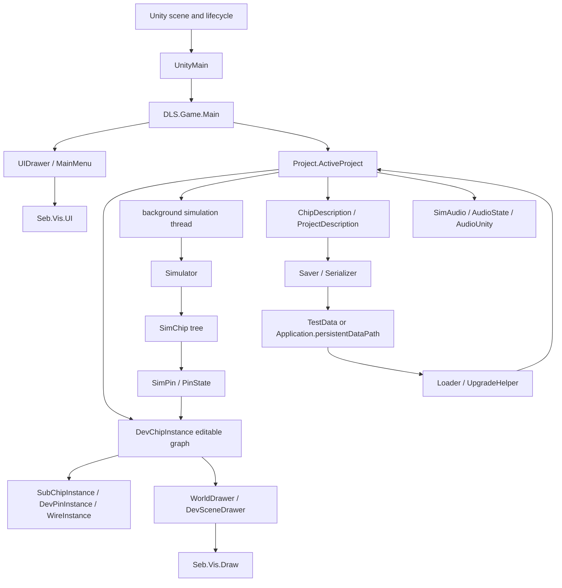
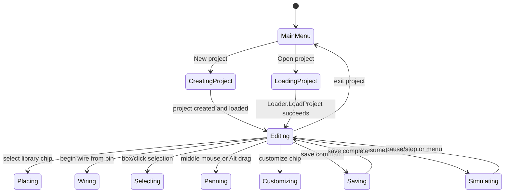
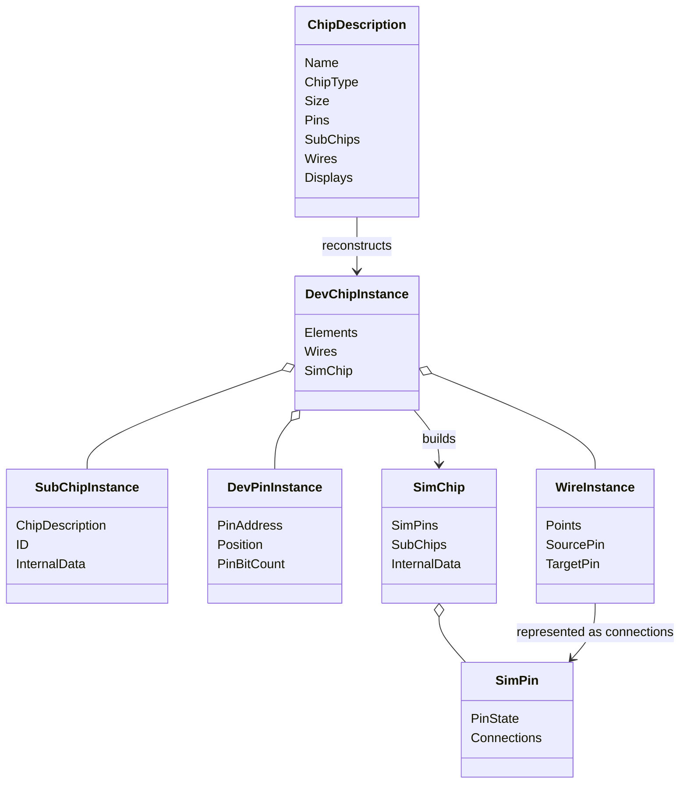
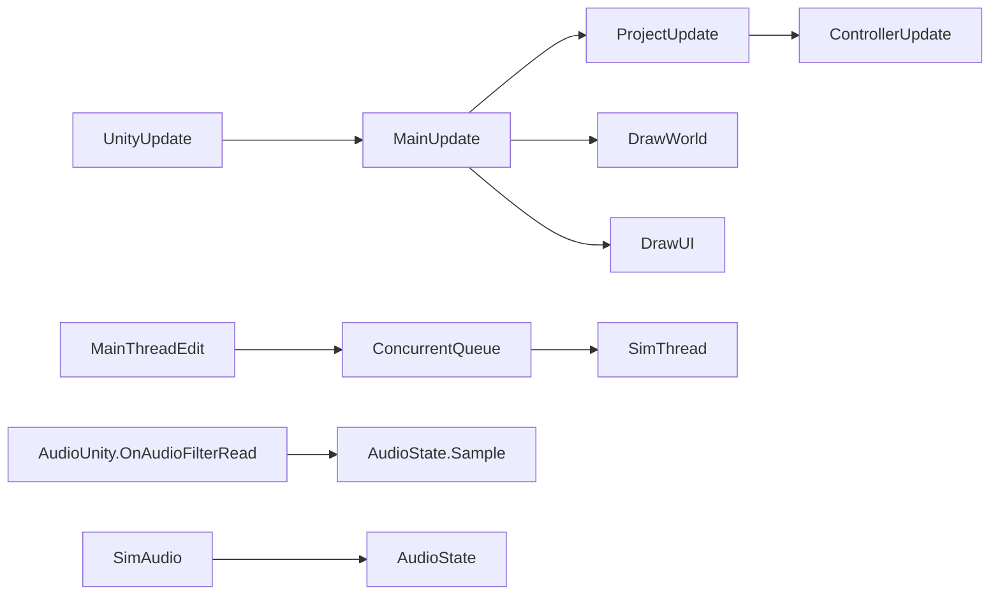
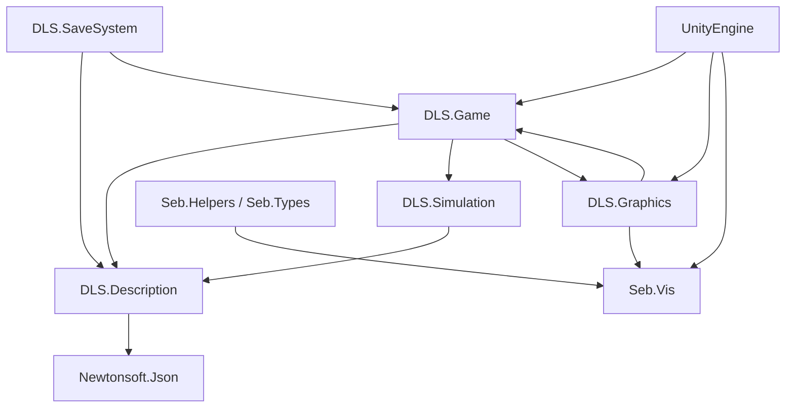
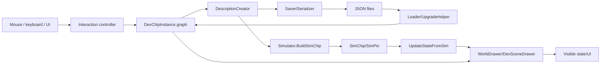

# TERBIUM 65 Full Codebase Reference

**Repository reviewed:** `Terbium 65` Unity project

**Evidence policy:** This document is based on checked-in C# source, assembly definitions, Unity scene/project metadata, package metadata, README, and checked-in `TestData`. Claims about behavior cite concrete types, methods, fields, and paths. Statements that cannot be established from those files are marked `UNCERTAIN:`. Generated folders such as `Library`, `Temp`, `Logs`, `obj`, `Build`, `Builds`, `UserSettings`, and `.git` are excluded from architectural conclusions.

---

## 1. Executive Overview

Terbium 65 is a Unity application for constructing, saving, viewing, and simulating digital logic circuits. It is a fork or continuation of Sebastian Lague's Digital Logic Sim, with the project identity set to Terbium 65 in `ProjectSettings/ProjectSettings.asset` and with a large custom UI/theme surface in `Assets/Scripts/Graphics/UI`.

The central problem is hierarchical circuit construction: a user places input/output pins and built-in or saved custom chips, connects them with wires, edits chip interfaces, and runs the resulting design. The application has two intentionally different representations of a circuit:

- **Editable/runtime representation:** `DLS.Game.Project`, `DLS.Game.DevChipInstance`, `SubChipInstance`, `DevPinInstance`, and `WireInstance`.
- **Executable simulation representation:** `DLS.Simulation.SimChip`, `SimPin`, `PinState`, and `Simulator`.
- **Persistence representation:** `DLS.Description.Types.ChipDescription`, `ProjectDescription`, and nested description DTOs.

Unity supplies scene loading, `MonoBehaviour` lifecycle callbacks, input/audio/camera objects, the `Color`/`Vector2` types, and the platform/player shell. The application-specific engine begins in `DLS.Game.UnityMain`, `DLS.Game.Main`, the `Project` model, the description/save system, `Simulator`, and the Seb.Vis renderer/UI layer.

The major runtime flow is:



### Architectural style

The code is a hybrid of static application services, mutable model objects, recursive hierarchical data, and immediate-mode custom drawing. It is not a conventional Unity Canvas/GameObject application. Most editor objects are ordinary C# objects, while one scene-level `UnityMain` MonoBehaviour bridges Unity's lifecycle to static DLS systems. Rendering and UI are issued each frame through Seb.Vis commands.

### Runtime, editor, simulation, graphics, UI, persistence, and input

- **Runtime shell:** `UnityMain.Awake`, `UnityMain.Update`, and `UnityMain.OnDestroy`.
- **Application state:** static `Main`, `Project.ActiveProject`, `UIDrawer`, `InteractionState`, and `CameraController`.
- **Editor:** `ChipInteractionController` mutates `DevChipInstance` and its elements.
- **Simulation:** `Project.SimThread` owns a background loop; `Simulator` evaluates a recursive `SimChip` graph.
- **Graphics:** `WorldDrawer`, `DevSceneDrawer`, `CustomizationSceneDrawer`, `WireDrawer`, and Seb.Vis.
- **UI:** `UIDrawer` dispatches menu modes; menu classes such as `MainMenu`, `ChipLibraryMenu`, and `PreferencesMenu` issue immediate-mode controls.
- **Persistence:** `DescriptionCreator` translates runtime objects to DTOs; `Saver`/`Loader` and `Serializer` write/read JSON.
- **Input:** `Seb.Helpers.InputHelper` abstracts Unity input; `ChipInteractionController`, `CameraController`, and UI handles consume it.

---

## 2. Complete Repository Map

```text
Terbium 65/
  Assets/
    Build/
      DLS.unity
      icon.png
    Dev/
      DLS.Dev.asmdef
      SaveRefac/DevSaveDataRefactor.cs
      VidTools/                 # development/video tooling
      VidTools/Scenes/*.unity
    Scripts/
      DLS.asmdef
      Description/              # serializable, Unity-independent-ish data model
      Game/                     # application, project model, editor objects/input
      Graphics/                 # draw settings, world and custom UI
      SaveSystem/               # disk paths, JSON, load/save, upgrades
      Seb/                      # Seb.Vis renderer/UI and generic helpers
      Simulation/               # executable logic simulator
  Packages/manifest.json
  ProjectSettings/
  TestData/                     # editor save data and sample circuits
  README.md
```

### `Assets/Scripts/Description`

Namespace families are `DLS.Description`, `DLS.Description.Types`, `DLS.Description.Types.SubTypes`, and `DLS.Description.Serialization`. This is the durable data contract. It exists so a circuit can be serialized without serializing live editor objects, Unity renderer state, or simulator thread state. `ChipDescription` is the central chip DTO; `ProjectDescription` stores project-level preferences and chip organization; nested DTOs represent pins, subchips, wires, displays, and addresses.

### `Assets/Scripts/Game`

The `DLS.Game` namespace contains the running application model. `Main` and `UnityMain` own startup boundaries; `Project` owns the active project; `Game.Elements` owns editable visual/runtime entities; `Game.Interaction` owns camera, editor commands, selection, undo, and input interfaces. This is core architecture, not utility code.

### `Assets/Scripts/Graphics`

`DLS.Graphics` contains theme/drawing constants. `DLS.Graphics.World` renders circuit contents. `DLS.Graphics.UI` renders the custom immediate-mode interface and menus. It is the presentation layer over `Project`, `InteractionState`, and description/editor state.

### `Assets/Scripts/SaveSystem`

`DLS.SaveSystem` isolates filesystem paths, serialization, save/load conversion, and compatibility upgrades. It calls into `DLS.Description` and `DLS.Game`, but the DTOs do not own live runtime state.

### `Assets/Scripts/Seb`

`Seb` contains the custom visual framework. `Seb.Vis` provides draw layers, instanced shape drawing, text, cameras, and UI. `Seb.Helpers` and `Seb.Types` provide reusable geometry, input, color, pooling, and scope helpers. The `_Dev` subtree is development/demo code rather than core application behavior.

### `Assets/Scripts/Simulation`

`DLS.Simulation` is the executable circuit engine. `Simulator.BuildSimChip` converts descriptions into a recursive simulation graph. `SimChip` is the executable hierarchical component; `SimPin` carries state and connections; `PinState` encodes packed binary/disconnected signal data. `SimAudio` and `SimKeyboardHelper` bridge simulation to Unity-facing systems.

### `Assets/Dev`

`DLS.Dev` is a separate development assembly. `VidTools` contains input recording/playback, video scenes, cursors, and design tests. It is not part of the ordinary production circuit architecture. `SaveRefac` contains a development save-data refactor tool.

### Project-level folders

- `Assets/Build`: production scene and icon.
- `Packages`: Unity package manifest.
- `ProjectSettings`: Unity editor/player settings, build scene list, product/company metadata.
- `TestData`: editor-mode project files and a large deleted-project sample library.

---

## 3. File Catalog

The complete meaningful source inventory is below. Demo/test files in Seb.Vis and `Assets/Dev` are grouped because they do not define production architecture.

### Description and serialization

| File | Namespace | Main contents | Responsibility / users |
|---|---|---|---|
| `Description/Types/ChipDescription.cs` | `DLS.Description.Types` | `ChipDescription` | Durable chip DTO; consumed by loader, saver, simulator, and runtime reconstruction. |
| `Description/Types/ProjectDescription.cs` | `DLS.Description.Types` | `ProjectDescription` | Project preferences, chip ordering, collections, starred state. |
| `Description/Types/AppSettings.cs` | `DLS.Description.Types` | `AppSettings` | Resolution/fullscreen/VSync settings. |
| `Description/Types/SubTypes/ChipTypes.cs` | `DLS.Description.Types.SubTypes` | chip and display-related enums | Semantic classifications and settings enums. |
| `.../DisplayDescription.cs` | same | `DisplayDescription` | Serialized display placement/scale. |
| `.../PinAddress.cs` | same | `PinAddress` | Serialized/runtime pin identity pair. |
| `.../PinDescription.cs` | same | `PinDescription` | Name, ID, position, width, color, display mode. |
| `.../SubChipDescription.cs` | same | `SubChipDescription` | Placed component reference, ID, position, label, internal data. |
| `.../WireDescription.cs` | same | `WireDescription` | Wire endpoints, connection metadata, and points. |
| `Description/Helpers/ChipTypeHelper.cs` | `DLS.Description.Helpers` | static helpers | Names and classifications for built-in chip types. |
| `Description/Serialization/Serializer.cs` | `DLS.Description.Serialization` | `Serializer` | Newtonsoft.Json configuration and Unity type converters. |
| `.../UnsavedChangeDetector.cs` | same | `UnsavedChangeDetector` | Compares serialized descriptions to detect unsaved changes. |
| `.../Newtonsoft/Tests/Editor/SanityTests.cs` | test namespace | editor test | Minimal Newtonsoft round-trip sanity coverage. |

### Game and editor

| File | Main type | Responsibility |
|---|---|---|
| `Game/Main/UnityMain.cs` | `UnityMain` | Unity lifecycle bridge and audio hookup. |
| `Game/Main/Main.cs` | `Main` | Static application initialization, menu/project transitions, global settings. |
| `Game/Project/Project.cs` | `Project` | Active project ownership, viewed chip, simulation thread, save/update lifecycle. |
| `Game/Project/DevChipInstance.cs` | `DevChipInstance` | Editable chip graph and synchronization with `SimChip`. |
| `Game/Project/ChipLibrary.cs` | `ChipLibrary` | Built-in/custom chip lookup and parent relationships. |
| `Game/Project/BuiltinChipCreator.cs` | `BuiltinChipCreator` | Creates built-in chip descriptions/data. |
| `Game/Project/BuiltinCollectionCreator.cs` | `BuiltinCollectionCreator` | Creates default chip collections. |
| `Game/Elements/PinInstance.cs` | `PinInstance` | Base runtime pin state/identity. |
| `Game/Elements/DevPinInstance.cs` | `DevPinInstance` | Editable external pin with UI/selection behavior. |
| `Game/Elements/SubChipInstance.cs` | `SubChipInstance` | Placed chip instance and linked simulation chip. |
| `Game/Elements/WireInstance.cs` | `WireInstance` | Editable wire, points, connection metadata, and drawing state. |
| `Game/Elements/DisplayInstance.cs` | `DisplayInstance` | Editable display geometry and draw bounds. |
| `Game/Helpers/GridHelper.cs` | `GridHelper` | Grid snapping and straight-line geometry. |
| `Game/Helpers/IDGenerator.cs` | `IDGenerator` | Local IDs for circuit entities. |
| `Game/Interaction/CameraController.cs` | `CameraController` | World camera pan, zoom, fitting, and view state. |
| `Game/Interaction/ChipInteractionController.cs` | `ChipInteractionController` | Editor commands, hit targets, selection, placement, wiring. |
| `Game/Interaction/InteractionState.cs` | `InteractionState` | Static per-frame/global interaction state. |
| `Game/Interaction/KeyboardShortcuts.cs` | `KeyboardShortcuts` | Shortcut detection and snap-mode state. |
| `Game/Interaction/UndoController.cs` | `UndoController` | Undo/redo command/history behavior. |
| `Game/Interaction/Interfaces/IInteractable.cs` | `IInteractable` | Hit interaction contract. |
| `Game/Interaction/Interfaces/IMoveable.cs` | `IMoveable` | Position/selection/movement contract. |
| `Game/Audio/AudioState.cs` | `AudioState` | Synthesized sample state and time. |
| `Game/Audio/AudioUnity.cs` | `AudioUnity` | Unity audio callback bridge. |

### Graphics and UI

| File/group | Main types | Responsibility |
|---|---|---|
| `Graphics/DrawSettings.cs` | `DrawSettings`, `ThemeDLS`, `UIThemeDLS` | Colors, sizes, active themes. |
| `Graphics/World/WorldDrawer.cs` | `WorldDrawer` | Selects world/customization rendering mode. |
| `Graphics/World/DevSceneDrawer.cs` | `DevSceneDrawer` | Draws editable circuits, labels, displays, wires, selection. |
| `Graphics/World/CustomizationSceneDrawer.cs` | `CustomizationSceneDrawer` | Chip resizing/display customization scene. |
| `Graphics/World/WireDrawer.cs` | `WireDrawer` | Wire primitive drawing. |
| `Graphics/World/WireLayoutHelper.cs` | `WireLayoutHelper` | Wire geometry/layout and collision support. |
| `Graphics/UI/UIDrawer.cs` | `UIDrawer` | UI mode dispatch and frame-level UI setup. |
| `Graphics/UI/MenuHelper.cs` | `MenuHelper` | Shared UI layout/menu helpers. |
| `Graphics/UI/Themes/ThemeManager.cs` | `ThemeManager` | Palette loading and active theme mutation. |
| `Graphics/UI/Themes/ThemePalette.cs` | `ThemePalette` | Palette values and parsing. |
| `Graphics/UI/Menus/*.cs` | menu classes | Main menu, save/library/customization, editing dialogs, preferences, search, paused state, theme editor, viewed-chip bar, context menu. |

### Seb.Vis

`Seb/SebVis/Draw.cs`, `DrawManager.cs`, `TextDrawManager.cs`, internal drawers, `InstancedDrawer`, `ShapeData`, text loader/renderer classes, and `SebVis/UI` define the custom renderer/UI framework. `Seb/Types/Bounds2D.cs`, `Pool.cs`, `Scope.cs` and `Seb/Helpers/{Maths,ColHelper,InputHelper,StringHelper,ComputeHelper}.cs` are reusable support. `_Dev` files are visual tests/examples.

### Simulation and save system

| File | Main contents | Responsibility |
|---|---|---|
| `Simulation/Simulator.cs` | `Simulator` | Build graph, simulation loop, built-in processing, modification queue. |
| `Simulation/SimChip.cs` | `SimChip` | Executable hierarchical node and state. |
| `Simulation/SimPin.cs` | `SimPin` | Signal state, connection, conflict handling. |
| `Simulation/PinState.cs` | `PinState` | Packed signal value and disconnected mask. |
| `Simulation/SimAudio.cs` | `SimAudio` | Simulation-side buzzer/note registration. |
| `Simulation/SimKeyboardHelper.cs` | `SimKeyboardHelper` | Thread-safe keyboard snapshot. |
| `SaveSystem/DescriptionCreator.cs` | `DescriptionCreator` | Runtime-to-DTO conversion. |
| `SaveSystem/Loader.cs` | `Loader` | Project/chip file loading and reconstruction. |
| `SaveSystem/Saver.cs` | `Saver` | Project/chip/settings persistence. |
| `SaveSystem/SavePaths.cs` | `SavePaths` | Editor/build directories and filenames. |
| `SaveSystem/SaveUtils.cs` | `SaveUtils` | Filesystem/project helper functions. |
| `SaveSystem/UpgradeHelper.cs` | `UpgradeHelper` | Version migration of old descriptions. |

---

## 4. Class Catalog

| Type | File | Namespace | Responsibility | Base type | Key dependencies | Used by |
|---|---|---|---|---|---|---|
| `UnityMain` | `Game/Main/UnityMain.cs` | `DLS.Game` | Unity entry bridge | `MonoBehaviour` | `Main`, `AudioUnity`, `Project` | Unity scene |
| `Main` | `Game/Main/Main.cs` | `DLS.Game` | Global application coordinator | static class | `Loader`, `Saver`, `UIDrawer`, `Project` | `UnityMain`, UI |
| `Project` | `Game/Project/Project.cs` | `DLS.Game` | Active project owner | class | descriptions, simulator, controller | `Main`, editor/UI |
| `DevChipInstance` | `Game/Project/DevChipInstance.cs` | `DLS.Game` | Editable hierarchical chip | class | elements, `SimChip`, descriptions | `Project`, drawers |
| `SimChip` | `Simulation/SimChip.cs` | `DLS.Simulation` | Executable chip node | class | `SimPin`, `Simulator` | simulator/project |
| `Simulator` | `Simulation/Simulator.cs` | `DLS.Simulation` | Simulation engine | static class | `SimChip`, `SimPin`, queue | `Project.SimThread` |
| `SimPin` | `Simulation/SimPin.cs` | `DLS.Simulation` | Signal endpoint | class | `PinState` | `SimChip`, `Simulator` |
| `PinState` | `Simulation/PinState.cs` | `DLS.Simulation` | Packed logic state | struct/class | integer masks | pins/UI |
| `PinInstance` | `Game/Elements/PinInstance.cs` | `DLS.Game` | Runtime pin metadata/state | class | `PinAddress`, `SimPin` | dev/subchip |
| `SubChipInstance` | `Game/Elements/SubChipInstance.cs` | `DLS.Game` | Placed child chip | class | `ChipDescription`, `SimChip` | `DevChipInstance` |
| `WireInstance` | `Game/Elements/WireInstance.cs` | `DLS.Game` | Editable wire | class | pins, geometry | chip/controller/drawer |
| `ChipInteractionController` | `Game/Interaction/ChipInteractionController.cs` | `DLS.Game` | Editor state machine | class | project/elements/input/undo | `Project.Update` |
| `UIDrawer` | `Graphics/UI/UIDrawer.cs` | `DLS.Graphics.UI` | UI dispatcher | static class | menu classes, Seb.Vis.UI | `Main.Update` |
| `MainMenu` | `Graphics/UI/Menus/MainMenu.cs` | `DLS.Graphics.UI.Menus` | Main menu state/drawing | static class | `Main`, `Loader`, `Saver`, UI | `UIDrawer` |
| `WorldDrawer` | `Graphics/World/WorldDrawer.cs` | `DLS.Graphics.World` | World draw dispatcher | static class | `DevSceneDrawer` | `Main.Update` |
| `Draw` | `Seb/SebVis/Draw.cs` | `Seb.Vis` | Render command API | static class | drawers, Unity camera | world/UI |
| `Serializer` | `Description/Serialization/Serializer.cs` | `DLS.Description.Serialization` | JSON contract | static/class | Newtonsoft.Json | save/load |
| `ChipDescription` | `Description/Types/ChipDescription.cs` | `DLS.Description.Types` | Serialized chip | class | nested DTOs | loader/saver/sim |
| `ProjectDescription` | same | same | Serialized project | class | settings/collections | loader/main |

### Major class explanations

**`UnityMain`** is the Unity-owned root. `Awake` assigns its static instance, finds `AudioUnity`, calls `ResetStatics`, creates `AudioState`, assigns it to the audio bridge, initializes `Main`, and loads the main menu. `Update` delegates to `Main.Update`; `OnDestroy` notifies the active project. It owns very little application state itself.

**`Main`** is the static application coordinator. It owns active settings/project/audio state and menu/project transition functions such as `Init`, `LoadMainMenu`, `CreateOrLoadProject`, `CreateProject`, and `SaveAndApplyAppSettings`. Static ownership makes scene transitions simple but increases hidden coupling and requires `ResetStatics`.

**`Project`** owns the live project: `ProjectDescription`, `ChipLibrary`, active editable chip, viewed-chip stack, `ChipInteractionController`, simulation settings, audio state, and the simulation thread. `ActiveProject` is assigned by the constructor. `editModeChip` is the chip being edited; `ViewedChip` can represent a nested viewing context. `Project` is the central owner of editor and simulator synchronization.

**`DevChipInstance`** is the editable graph. Its `Elements` collection contains `IMoveable` instances, usually `SubChipInstance` and `DevPinInstance`; `Wires` contains `WireInstance`. It can create/remove objects, resolve `PinAddress` values, build descriptions, and copy state from a corresponding `SimChip`.

**`SimChip`** is deliberately separate from `DevChipInstance`. It stores executable `SimPin[]`, child chips, chip type, IDs, internal data, connection arrays, readiness counters, and processing state. It is built recursively from descriptions and accessed by the simulation thread.

**`Simulator`** evaluates `SimChip`. `RunSimulationStep`, `StepChip`, `ProcessBuiltinChip`, `BuildSimChip`, `ApplyModifications`, and `UpdateKeyboardInputFromMainThread` are the key boundary methods. It uses a `ConcurrentQueue<SimModifyCommand>` to move graph edits from the Unity thread to the simulator thread.

**`ChipInteractionController`** is the editor state machine. It controls placing/moving/deleting, selection, wire creation, wire-point edits, bus pairing, snapping, duplication, shortcuts, and undo. It reads `InteractionState`, camera/world geometry, and the active project.

**`UIDrawer`/menu classes** are static immediate-mode views. `UIDrawer` selects menu modes and sets up a fixed 16:9 UI scope. Menu classes retain handles and local popup state, then call project/main operations when controls are activated.

**`Draw`** is the Seb.Vis rendering facade. It creates layers and draw commands; `DrawManager` connects those commands to Unity camera render callbacks. It is not a Unity Canvas abstraction.

---

## 5. Program Startup

The checked-in build list is `ProjectSettings/EditorBuildSettings.asset`; it enables `Assets/Build/DLS.unity`. The scene contains root objects for the camera, `Main`, and `Audio`. `Main` has `UnityMain`; `Audio` has `AudioUnity`, an `AudioSource`, and an audio mixer reference.

Confirmed startup trace:

```text
Unity loads Assets/Build/DLS.unity
  -> Unity invokes UnityMain.Awake()
  -> UnityMain.instance = this
  -> find AudioUnity
  -> UnityMain.ResetStatics()
       -> Simulator.Reset()
       -> UIDrawer.Reset()
       -> InteractionState.Reset()
       -> CameraController.Reset()
       -> WorldDrawer.Reset()
  -> create AudioState
  -> AudioUnity.audioState = AudioState
  -> Main.Init(audioState)
       -> load app settings
       -> save defaults if required
       -> initialize theme/settings
  -> Main.LoadMainMenu()
  -> subsequent UnityMain.Update() calls Main.Update()
```

`Draw.InitializeOnLoad` is a static initialization path for Seb.Vis that registers camera callbacks and initializes shape/text drawers. Exact ordering relative to `UnityMain.Awake` is Unity/static-runtime dependent.

`UNCERTAIN:` The repository establishes the scene and component script, but does not fully document Unity inspector serialization for every scene field in prose. The scene YAML is the authority for exact serialized values.

---

## 6. Unity Lifecycle

Meaningful lifecycle implementations are concentrated in `UnityMain` and audio/render bridges:

| Callback | Implementation | Behavior |
|---|---|---|
| `Awake` | `UnityMain.Awake` | Establishes static root, resets static systems, initializes audio/main/menu. |
| `Update` | `UnityMain.Update` | Audio test/debug work when enabled, then `Main.Update`. |
| `OnDestroy` | `UnityMain.OnDestroy` | Calls `Project.ActiveProject.NotifyExit`. |
| `OnAudioFilterRead` | `AudioUnity.OnAudioFilterRead` | Samples `AudioState`, applies gain/clipping, writes audio buffer. |

The source inventory does not show a production `FixedUpdate`, `LateUpdate`, `OnGUI`, `OnEnable`, `OnDisable`, `OnApplicationQuit`, `OnApplicationFocus`, or `OnApplicationPause` implementation in the core scripts. Development tooling may contain additional lifecycle methods.

Per-frame path:

```text
UnityMain.Update
 -> Main.Update
    -> CameraController.Update
    -> Project.Update
       -> controller.Update
       -> simulator input bridge / state synchronization
    -> InteractionState.ClearFrameState
    -> WorldDrawer.DrawWorld
    -> UIDrawer.DrawUI
    -> global keyboard shortcuts
```

Rendering and UI are frame-driven. Simulation is decoupled into `Project.SimThread`; the default settings are approximately 1000 simulation steps per second and 250 steps per clock transition. Input is sampled on the Unity/main thread and copied to the simulation thread through `SimKeyboardHelper` and modification/input bridges.

---

## 7. Global State and Application State

Important static/global state includes:

- `Main.ActiveProject`, app settings, audio state, DLS version, and menu/project transitions.
- `Project.ActiveProject`, plus project-owned controller, chip library, viewed-chip stack, and simulation thread.
- `UIDrawer` menu type, handles, paused/menu state, and UI hover routing.
- `InteractionState` hovered element, selected/under-mouse objects, mouse/UI flags, and per-frame interaction flags.
- `CameraController` view states for main menu, customization, and chips.
- `WorldDrawer`, `DevSceneDrawer`, and theme objects holding draw-time state.

State concepts are distributed rather than represented by one enum. Main-menu versus project editing is primarily `UIDrawer.MenuType` and whether `Project.ActiveProject` exists. Placement, wiring, selection, dragging, and panning are controller fields and `InteractionState` flags. Menus block editor input by setting/reading UI-over state. Simulation pause and speed are project preferences plus `SimPausedUI` state.

The active user transitions are:



`UNCERTAIN:` There is no single authoritative state-transition table; some transitions are implicit in controller/menu field combinations.

---

## 8. Circuit Data Model

A circuit is a `ChipDescription` containing external pins, placed `SubChipDescription` objects, `WireDescription` objects, and `DisplayDescription` objects. At runtime it becomes a `DevChipInstance` with `DevPinInstance`, `SubChipInstance`, and `WireInstance`. For execution it becomes a `SimChip` with `SimPin` connections.



A `PinAddress` is `(PinOwnerID, PinID)`. For a dev pin, the owner is the dev-pin ID and the pin ID is `0`; for a subchip pin, the owner is the subchip ID and the pin ID is the internal pin ID. IDs are local to a chip namespace and generated through `IDGenerator`/creation logic.

A `SubChipDescription` references a chip by name and stores local instance identity, label, position, output color metadata, and `uint[] InternalData`. Internal data is overloaded by built-in type for ROM contents, key bindings, pulse state, LED color, and bus pairing/orientation.

A wire stores endpoint addresses, connection type, connected-wire/segment indexes, and route points. Direct pin endpoints are serialized as zero vectors by design because the pin geometry can be reconstructed.

---

## 9. Component System

There is no single universal `Component` base class. Component identity is primarily represented by `ChipType`, `SubChipDescription`, `SubChipInstance`, and the simulation-side `SimChip`. External pins are separate `DevPinInstance` objects. `IMoveable` and `IInteractable` define editor capabilities rather than component semantics.

Creation path:

```text
User opens chip library / selects a built-in or custom chip
 -> ChipLibrary lookup and ChipType metadata
 -> ChipInteractionController starts placement
 -> create SubChipInstance from chip description
 -> assign local ID, position, label, and internal data
 -> add to DevChipInstance.Elements
 -> update description/undo state
 -> enqueue simulator graph modification
 -> DevSceneDrawer renders it
```

Built-ins are constructed by `BuiltinChipCreator`: I/O pins, NAND, tri-state buffer, clocks, pulse, RAM, ROM, merge/split, displays, buses, bus termini, and buzzer are represented as built-in descriptions and processed specially by `Simulator.ProcessBuiltinChip`.

Deletion flows through `ChipInteractionController` and `DevChipInstance` removal methods. It must remove associated wires and update simulation modifications. `UndoController` records the applicable editor operation. Exact command granularity is implementation-specific in `UndoController`.

Duplication/copy-paste is implemented in the controller for selected moveables; bus-linked items receive special handling so linked bus endpoints remain coherent.

---

## 10. Pin and Port System

`PinInstance` owns address, width, bus/source flags, parent, simulation state, player-input state, color, name, and local layout position. `DevPinInstance` adds world position, selection state, state-display geometry, decimal/hex display behavior, and player toggling. Simulation uses `SimPin` and `PinState`.

Supported `PinBitCount` values are 1, 4, and 8 according to the description model. Multi-bit values are represented in packed `uint` masks rather than as arrays of independent trits/bits.

Direction is represented by pin ownership/type and by source/destination connection construction. Fan-out is supported by a `SimPin` connection collection. A destination can receive multiple sources; conflict resolution is handled by `SimPin.ReceiveInput`.

There is no evidence of a separate general `Port` or `Connector` class. Those concepts are represented by pin addresses and wire connections.

---

## 11. Wires and Connections

`WireInstance` owns route points, source/target connection metadata, bit-wire buffers, wire-to-wire dependencies, recursion depth, draw order, movement offset, and spawn order. `WireDescription` is its serialized counterpart.

Wire creation path:

```text
Mouse press on pin
 -> ChipInteractionController identifies source pin
 -> temporary wire/interaction state begins
 -> pointer movement updates route points and snapping
 -> target pin or wire segment is hit
 -> validate direction, width, bus and ownership rules
 -> create/update WireInstance
 -> add connection metadata to chip graph
 -> enqueue simulator modification
 -> WireDrawer/DevSceneDrawer renders final route
```

`WireLayoutHelper` and `WireDrawer` handle geometry, segments, and draw ordering. `GridHelper` snaps points to `0.125` world units and can force even grid coordinates or straight horizontal/vertical segments. Wire deletion/reconnection removes dependent wire links and updates both editor and simulator representations.

Bus origins and termini are paired via `SubChipInstance.InternalData[0]`; `[1]` stores flip/orientation. The controller requires matching linked IDs and corrects bus wires toward the origin for simulation. This is a special connection topology rather than a separate general graph framework.

---

## 12. Simulation Engine

The simulator is a recursive, iterative, thread-based digital logic engine. It is not GPU-based and is not a conventional topologically sorted DAG evaluator.

### Construction

`Simulator.BuildSimChip` recursively converts a `ChipDescription` into a `SimChip` tree. Each `SimChip` contains pins, children, built-in type/internal data, IDs, readiness counters, and connection structures. `Project` associates the simulation tree with editable chips and starts `SimThread`.

### Step processing

`Project.SimThread` targets `Prefs_SimTargetStepsPerSecond` and spin-waits to maintain its tick duration. It applies queued modifications, invokes `Simulator.RunSimulationStep`, and updates state/audio. `RunSimulationStep` initializes audio as necessary, copies player-controlled input state, performs a traversal/order pass when required, otherwise calls `StepChip`, and updates audio.

`StepChip` propagates ready inputs, processes child chips, and propagates outputs. Readiness is tracked by `Sim_IsReady`, which compares `numInputsReady` and `numConnectedInputs`. `ChooseNextSubChip` chooses the next child, randomly preferring non-bus chips before bus chips. Every 100 frames, dynamic traversal reordering may occur.

This means the engine is best classified as **tick-driven with iterative recursive graph traversal and readiness scheduling**. It is not proven to be a pure event-driven simulator, because `RunSimulationStep` is repeatedly invoked at a configured rate even when nothing visibly changed. It is not proven to use a global topological sort; the source instead shows readiness counters, child choice, recursion, and periodic order changes.

### Built-ins

`Simulator.ProcessBuiltinChip` handles NAND, clock, pulse, merge/split conversion, tri-state buffer, keyboard key, RGB/dot display memory, RAM, ROM, buzzer, and bus behavior. Stateful display and RAM processing uses rising-edge detection on a final internal-state slot. Exact truth behavior must be read from `ProcessBuiltinChip`; names alone do not define the implementation.

### Signal propagation

```text
Player input or built-in output changes
 -> SimPin state is written
 -> connected SimPin inputs receive state
 -> readiness counters/connection state update
 -> StepChip processes ready child/built-in
 -> output SimPin state is written
 -> downstream SimPins receive the state
 -> DevChipInstance.UpdateStateFromSim copies visible state/color to editor
 -> DevSceneDrawer renders it
```

### Conflicts, cycles, and feedback

`SimPin.ReceiveInput` accepts the first input, accepts tristated bits, and for conflicting inputs randomly chooses OR or AND behavior for the conflicting multi-bit state. The choice is per multi-bit pin state, not independently per bit. Recursive traversal and readiness logic allow feedback/cyclic designs, but the repository does not provide a formal convergence proof or cycle-specific test suite.

`UNCERTAIN:` The exact termination/convergence behavior for every cyclic network cannot be established without executing targeted circuits. The implementation visibly contains recursion depth/order fields and scheduling, but no formal fixed-point specification.

### Threading

The simulation thread is named `DLS_SimThread`. Main-thread edits enqueue `SimModifyCommand` objects in a `ConcurrentQueue`; `Simulator.ApplyModifications` consumes them on the simulation thread. `DevChipInstance.UpdateStateFromSim` copies state back and catches/logs some transient exceptions caused by concurrent edits.

---

## 13. Simulation Timing

Project defaults are reported by the source as approximately 1000 simulation steps/second and 250 steps/clock transition. `Project.SimThread` uses a target step duration and spin-waits, so simulation time is intended to be independent of ordinary Unity render FPS but remains dependent on OS scheduling and thread availability.

Clock/pulse components use step counts, not direct Unity frame counts, through simulator internal data and `Prefs_SimStepsPerClockTick`. Audio is separately sampled by Unity's audio callback, with simulation events registered into `SimAudio` and consumed by `AudioState.Sample`.

Performance consequences are visible in code: spin-waiting can consume CPU; recursive traversal can become expensive for large hierarchies; random scheduling can complicate deterministic reproduction; and cross-thread state copying tolerates transient exceptions. No benchmark is included.

---

## 14. Boolean and Binary Representation

The important binary assumptions are concentrated in `Simulation/PinState.cs`, `SimPin.cs`, built-in processing, and description widths.

| File/type | Code concept | Current meaning | Binary assumption? | Ternary impact |
|---|---|---|---|---|
| `Simulation/PinState.cs` | `uint` value/masks | Low 16 bits represent binary signal values; high 16 bits represent disconnected flags. | Yes, packed bit model. | Critical: replace or wrap with a trit/vector representation. |
| `Simulation/SimPin.cs` | `ReceiveInput` | Combines/conflicts source states using binary OR/AND-like behavior plus disconnected bits. | Yes. | Critical: conflict and tri-state semantics must be redesigned. |
| `Simulation/Simulator.cs` | NAND/logic built-ins | Built-in truth operations operate on packed bit values. | Yes. | Critical: truth-table APIs need trit semantics. |
| `Description/Types/SubTypes/PinDescription.cs` | `PinBitCount` 1/4/8 | Width is number of binary bits. | Yes. | Major: likely becomes width/arity independent of bit packing. |
| `SubChipDescription.InternalData` | `uint[]` | Encodes ROM words, colors, key/pulse state, bus IDs/flags. | Mixed. | Major for ROM/RAM words; minor for IDs/flags. |
| `Game/Elements/DevPinInstance.cs` | high/low display | User-facing binary state labels and numeric representations. | Yes. | Major: new negative/zero/positive rendering. |
| `Graphics/World/DevSceneDrawer.cs` | state colors/values | Draws binary/disconnected state indicators and decimal/hex values. | Yes. | Major. |
| `Game/Project/BuiltinChipCreator.cs` | built-in widths and logic | Creates binary-oriented chips and memory. | Yes. | Major/critical for component library. |
| `Description/Serialization/Serializer.cs` | integer JSON values | Serialization itself is not inherently binary logic, but integer-packed fields are. | Indirect. | Major where packed signals are persisted. |
| `Seb` and UI booleans | flags/controls | Program control, not circuit signal. | No. | None. |

The current high-16 disconnected mask makes a signal effectively three-valued per bit (low, high, disconnected), but that is not balanced ternary and does not provide `-1, 0, +1`. It is a binary bus with a special high-impedance state.

---

## 15. Description System

Description objects are durable, serializable snapshots. They separate editor/runtime identity from disk format and provide the input to simulator construction.

- `ChipDescription`: version, name, name location, `ChipType`, size, color, external input/output pins, subchips, wires, and displays.
- `ProjectDescription`: project name/version/date, display preferences, simulation preferences, custom chip ordering, starred items, and collections. Cached display strings are ignored by JSON and rebuilt after load.
- `PinDescription`: pin name, ID, position, `PinBitCount`, `PinColour`, and `PinValueDisplayMode`.
- `SubChipDescription`: referenced chip name, local ID, label, position, output color metadata, `InternalData`.
- `WireDescription`: source/target `PinAddress`, connection type, wire/segment indexes, and points.
- `DisplayDescription`: subchip ID, local position, and scale; built-in displays use `SubChipID = -1`.
- `PinAddress`: owner/pin identity used for graph resolution.

The description layer does not own live hover, selection, draw handles, Unity objects, simulation thread state, or camera state. `DescriptionCreator` converts live objects to descriptions; `Loader` reconstructs live objects; `Simulator.BuildSimChip` consumes descriptions or reconstructed data.

---

## 16. Save System

Save flow:

```text
Project/editor state
 -> DescriptionCreator creates ChipDescription/ProjectDescription
 -> Saver.SaveChip or Saver.SaveProjectDescription
 -> Serializer serializes Newtonsoft.Json object graph
 -> SavePaths chooses TestData in editor or persistentDataPath in builds
 -> ProjectDescription.json and Chips/<name>.json
```

`SavePaths.AllData` resolves to the project-root `TestData` directory when `UseBuildPathInEditor` is false. Builds use `Application.persistentDataPath`. Project files use `ProjectDescription.json`; chips are stored under `Chips` with names ending in `.json`.

`Serializer` configures Newtonsoft.Json and custom converters for Unity `Vector2`, `Color`, and `DateTime`. Vectors are rounded to five decimals; colors serialize as `r/g/b/a`; dates use `yyyy-MM-ddTHH:mm:ss.fffK`.

`Saver.SaveProjectDescription` stamps save time and current compatibility versions. `Project.SaveFromDescription` updates parent chips, saves chips, updates the library, collections/starred state, project description, recent-chip state, and camera naming.

Structural save shape, without fabricating literal data:

```json
{
  "DLSVersion": "...",
  "Name": "...",
  "ChipType": "Custom",
  "Size": { "x": 0, "y": 0 },
  "Pins": [ { "ID": 0, "Name": "...", "Position": { "x": 0, "y": 0 }, "PinBitCount": "..." } ],
  "SubChips": [ { "ChipName": "...", "ID": 0, "Position": { "x": 0, "y": 0 }, "InternalData": [] } ],
  "Wires": [ { "SourcePin": { "PinOwnerID": 0, "PinID": 0 }, "TargetPin": { "PinOwnerID": 0, "PinID": 0 }, "Points": [] } ],
  "Displays": [ { "SubChipID": -1, "Position": { "x": 0, "y": 0 }, "Scale": 1 } ]
}
```

The exact property names and optional fields are defined by the DTO source and serializer configuration; the shape above is structural only.

---

## 17. Load System

```text
Loader.LoadProject
 -> read ProjectDescription.json
 -> Serializer.Deserialize
 -> UpgradeHelper.ApplyVersionChanges
 -> load/build ChipLibrary
 -> resolve chip files and built-ins
 -> create Project
 -> LoadDevChipOrCreateNewIfDoesntExist
 -> reconstruct DevChipInstance/elements/wires
 -> repair/skip invalid wires or missing pins where loader permits
 -> Simulator.BuildSimChip
 -> establish active/viewed chip
 -> begin normal Main.Update loop
```

`Loader.LoadAllProjectDescriptions` ignores invalid project directories/files rather than failing the complete menu listing. `LoadDevChipOrCreateNewIfDoesntExist` can create a new chip when the requested chip is absent and can skip failed elements/wires. This is resilient but can hide partial corruption.

`UpgradeHelper.ApplyVersionChanges` currently handles pre-2.1.5 data, including pin-color index insertion, LED internal-data initialization, and version stamping. `Main.DLSVersion` is `2.1.6`; earliest compatible version is `2.0.0` according to the inspected code.

---

## 18. Graphics Architecture

Production graphics are custom and immediate-mode. `WorldDrawer.DrawWorld` starts a world layer and selects `CustomizationSceneDrawer` or `DevSceneDrawer`. `DevSceneDrawer.DrawActiveScene` draws the active grid, wires, moveable elements, labels, selected elements, hover pin, and selection box.

`DrawSettings` supplies dimensions, colors, state colors, and active mutable themes. The grid color is `ActiveTheme.GridCol`; the current source initializes and runtime-rebuilds this as `Color.black`.

Seb.Vis uses command layers and instanced drawing. `Draw.StartLayer` creates shape/text layers. `Draw.OnPreRender` dispatches command buffers before image effects and attaches them to cameras. Shapes use `InstancedDrawer<ShapeData>` and `DrawMeshInstancedIndirect`. Text is parsed into glyph/Bezier data and rendered by `TextRenderer`.

Coordinate systems:

- Circuit/world coordinates: `Vector2` positions in `DevChipInstance`, element positions, wires, grid, and camera view.
- Screen coordinates: Unity/Seb camera projection and mouse positions.
- UI coordinates: fixed 16:9 `Seb.Vis.UI.UI` scope with layout anchors/handles.
- Local chip coordinates: pin/subchip/wire positions relative to the owning `DevChipInstance`.

`CameraController` performs world/screen conversion and supports zoom-to-cursor, panning, chip fitting, and per-view `ViewState`.

---

## 19. Seb.Vis

Seb.Vis is checked into `Assets/Scripts/Seb/SebVis`, so it is an in-repository rendering/UI library rather than an external package. `Draw`, `DrawManager`, and `TextDrawManager` form its public production facade. Internal classes provide shape instancing, text loading/parsing/layout, quad generation, and render dispatch.

Important layers:

- `Seb.Vis.Draw`: public primitive/layer API.
- `Seb.Vis.DrawManager`: Unity camera/render callback integration.
- `Seb.Vis.Internal.InstancedDrawer`: batched/instanced shape rendering.
- `Seb.Vis.Internal.SebText`: font parser, glyph data, layout, and renderer.
- `Seb.Vis.UI.UI`: scope and immediate-mode controls.
- `Seb.Vis.UI.UIHandle`, `UIStates`, `UILayoutHelper`: handles, focus/hover/state, and layout.

Production code calls `Draw.Quad`, `Draw.Line`, `Draw.Text`, `Draw.StartLayer`, and UI button/layout methods. `_Dev` examples such as `LinesTest`, `TextTest`, and `ThemeSelector` demonstrate the library but are not required for normal DLS startup.

---

## 20. Seb.Helpers and Seb.Types

- `Bounds2D`: axis-aligned bounds, containment/overlap and geometry checks used by hit testing and draw bounds.
- `Maths`: common vector/geometry/math helpers used by camera, layout, and wire code.
- `ColHelper`: color manipulation used by themes and rendering.
- `InputHelper` and input sources: abstracts Unity input and allows recorded input sources in development tooling.
- `StringHelper`: text formatting and manipulation for labels/UI.
- `ComputeHelper`: GPU/compute support utilities where used by renderer internals.
- `Pool<T>`: reusable object/buffer lifetime support.
- `Scope`: structured draw/UI scope cleanup.

These are infrastructure helpers. `Bounds2D`, `Maths`, input abstraction, and scopes are architecturally important because they sit on editor/render boundaries; color/string helpers are broadly reusable but less central.

---

## 21. Camera System

`CameraController` stores view state for the main menu, customization scene, and each chip. Middle-mouse or Alt-drag pans; scroll or Alt-drag changes zoom; zoom can preserve the world point under the cursor. Reset-camera shortcuts restore a known view. `GetViewForChip` computes a view that fits chip bounds.

The camera is an orthographic Unity camera positioned at approximately `(0, 0, -10)` in `Assets/Build/DLS.unity`. World geometry is authored in circuit units; the camera maps those to screen pixels. `ChipInteractionController` relies on this mapping for hit testing and placement, while `WorldDrawer` draws in world scope and `UIDrawer` draws in UI scope.

---

## 22. UI System

The UI is custom immediate-mode Seb.Vis UI, not Unity Canvas. `UIDrawer` creates the UI scope and dispatches menus based on menu state. Menu classes create buttons, panels, labels, popups, text fields, toggles, wheels, and scroll views each frame. Handles retain interaction state between frames.

Important menus include:

- `MainMenu`: project selection, new/open/delete/settings/about.
- `BottomBarUI`: editor controls and status.
- `ChipLibraryMenu`: component/chip selection.
- `ChipSaveMenu`: save and customization entry.
- `ChipCustomizationMenu`: resize/display customization.
- `PinEditMenu`, `ChipLabelMenu`, `PulseEditMenu`, `RomEditMenu`, `RebindKeyChipMenu`: property editing.
- `ContextMenu`, `SearchPopup`, `UnsavedChangesPopup`, `PreferencesMenu`, `ThemeEditorMenu`, `SimPausedUI`, `ViewedChipsBar`.

UI hover/focus sets `InteractionState.MouseIsOverUI` and blocks editor input where appropriate. Menus call `Main`, `Project`, `ChipInteractionController`, and save APIs rather than directly owning the circuit graph.

---

## 23. Main Menu

`Graphics/UI/Menus/MainMenu.cs` is a static immediate-mode screen. It owns screen selection, popup kinds, project arrays, selected project index, settings state, UI handles, palette constants, and project validation/drawing logic.

Main menu click path:

```text
UnityMain.Update -> Main.Update -> UIDrawer.DrawUI -> MainMenu.Draw
 -> Seb.Vis button handle detects press
 -> MainMenu handler identifies action
 -> Main.CreateOrLoadProject / Main.LoadMainMenu / Main.SaveAndApplyAppSettings
 -> Loader/Saver/Project changes global state
 -> next frame UIDrawer selects new menu/editor view
```

New project uses `Main.CreateOrLoadProject`, `Main.CreateProject`, `Saver.SaveProjectDescription`, then `Loader.LoadProject`. Opening a project uses the same transition with `Loader.LoadProject` and `Loader.LoadChipLibrary`. Settings edit `AppSettings` and call `Main.SaveAndApplyAppSettings`.

The current implementation uses a dark palette with cyan/red accents, recent project rows, quick-start cards, sidebar navigation, settings/about views, and project-management popups. Exact visual layout is in `MainMenu.cs`; it is not represented by Unity prefab hierarchy.

---

## 24. Editor System

The editor is controlled by `ChipInteractionController.Update`. It consumes mouse/keyboard state, camera transforms, UI blocking state, and the active `DevChipInstance`.

Supported workflows include placement, selection, dragging, multi-selection, duplication, deletion, wire creation, wire-point editing, bus pairing, snapping, straight-line constraints, context menus, customization, and undo/redo. `KeyboardShortcuts` provides named shortcuts and snap-mode state. `GridHelper` supplies the `0.125` grid and anchor-preserving movement.

Chip hierarchy is navigated through `Project.EnterViewMode` and `ReturnToPreviousViewedChip`. `chipViewStack` retains nested viewed chips. `editModeChip` is the actual editable chip; a viewed chip can be read-only or nested relative to that editing context.

Undo is mediated by `UndoController`, while save validity/unsaved state is checked using descriptions and `UnsavedChangeDetector`.

---

## 25. Input System

| Input | Context | Handler | Result |
|---|---|---|---|
| Left click | UI | Seb.Vis UI handles/menu classes | Activates button, selects row, edits field. |
| Left click | World | `ChipInteractionController` | Selects element, starts placement/wire/drag based on state. |
| Right click | World/editor | `ChipInteractionController` / `ContextMenu` | Context actions/cancel/menu. |
| Middle mouse | World | `CameraController` | Pan. |
| Wheel | World | `CameraController` | Zoom, often cursor-preserving. |
| Drag | World | controller/camera | Move selection, route wire, pan. |
| Keyboard shortcuts | editor | `KeyboardShortcuts`, controller | Delete, duplicate, undo/redo, reset, snap, cancel, navigation. |
| Alt modifier | camera | `CameraController` | Alternate pan/zoom gestures. |
| Text input | UI/menu | Seb.Vis input controls and menu classes | Names, labels, ROM/pulse/key properties. |
| Key-held circuit input | simulation | `SimKeyboardHelper` | Updates key built-ins from a thread-safe snapshot. |

`InputHelper` is the abstraction point. Development `VidTools` can replace the input source with recorded/playback input. Exact key bindings are enumerated in `KeyboardShortcuts.cs` and menu-specific handlers.

---

## 26. Selection System

Selection is stored by `ChipInteractionController.SelectedElements`. Hover is represented by `InteractionState.ElementUnderMouse` and related fields populated during draw/hit-test passes. `IMoveable.ShouldBeIncludedInSelectionBox` decides whether a moveable enters a box selection.

Selection mutation includes click selection, additive/multi-selection, box selection, deselection on cancel, and linked-bus inclusion. `DevSceneDrawer` draws selected elements on top of nonselected elements and renders selection boxes using theme colors. Moving selection validates overlap/obstacles and bus-link completeness.

Selection is editor state, not serialized circuit state, unless a menu explicitly persists a user preference such as starred chips.

---

## 27. Geometry and Hit Testing

Geometry is distributed across `Bounds2D`, `Maths`, `GridHelper`, `WireLayoutHelper`, and element-specific bounds methods. Component hit testing uses moveable bounds and world positions. Wire hit testing uses segments/points and wire layout helpers. Selection boxes compare element bounds against a rectangle.

`GridHelper.SnapToGrid`, `SnapMovingElementToGrid`, `SnapToGridForceEven`, and `ForceStraightLine` are the primary editor geometry operations. `DisplayInstance.LastDrawBounds` supports customization hit testing. `WireLayoutHelper` handles route geometry and collision-related operations.

World/screen conversion belongs to `CameraController` and input mapping; UI hit testing belongs to Seb.Vis.UI handles.

---

## 28. Text System

Text is rendered by Seb.Vis, not Unity UI text. `Draw.Text` accepts formatted strings and rich color tags. `FontMap`, `FontParser`, `FontReader`, glyph helpers, `TextLayoutHelper`, `TextRenderData`, and `TextRenderer` load font resources, parse glyph data, calculate layout, generate meshes/buffers, and issue instanced indirect draws.

DLS uses text for chip/pin labels, decimal/hex pin values, display names, menus, settings, status text, and popup controls. `SubChipInstance.CreateMultiLineName` splits long chip names for world labels. Font assets are loaded through `Resources.Load<TextAsset>` in `DrawManager` according to the inspected code.

---

## 29. Assets and Resources

Confirmed meaningful assets:

- `Assets/Build/DLS.unity`: production scene.
- `Assets/Build/icon.png`: application icon.
- `Assets/Dev/VidTools`: development scenes, prefab, cursor material/texture, and recordings tooling.
- Runtime font data loaded by Seb.Vis through Unity Resources.
- Newtonsoft source/package content under `Description/Serialization/Newtonsoft`.

`UNCERTAIN:` A complete inventory of textures, materials, shaders, prefabs, and Resources files cannot be inferred from the supplied source listing alone. No production component prefab hierarchy is required by the core code path; circuit components are ordinary C# objects drawn by Seb.Vis.

---

## 30. Scenes

| Scene | Role | Known objects/behavior |
|---|---|---|
| `Assets/Build/DLS.unity` | Production scene and only enabled build scene | Main camera, `Main` with `UnityMain`, `Audio` with `AudioUnity` and `AudioSource`. |
| `Assets/Dev/VidTools/Scenes/Dev.unity` | Development/video tooling | Used by `DLS.Dev`; not production startup. |
| `Assets/Dev/VidTools/Scenes/Vid_Name.unity` | Video capture/design tooling | Development-only scene. |

The build scene list is confirmed by `EditorBuildSettings.asset`. Scene transitions within the application mostly change static UI/project state rather than loading separate production scenes.

---

## 31. Unity Serialization Details

The application uses Unity serialization for scene `MonoBehaviour` fields and project settings, but circuit persistence is custom Newtonsoft JSON. `UnityMain` is the principal scene component. `AudioUnity` has Unity-facing audio fields. Seb.Vis may use Unity resource assets and camera callbacks.

`[SerializeField]` fields and public scene fields survive scene serialization; live static state, editor selections, draw handles, simulation thread state, and current hover do not survive a scene/domain reset unless explicitly reconstructed. Description DTOs and JSON are the durable circuit state.

`UNCERTAIN:` The source inventory does not establish every `[SerializeField]` declaration or every inspector value without a complete attribute scan of all files and scene YAML. The durable boundary is nonetheless clear: circuit data is saved by `DescriptionCreator`/`Saver`, not by Unity scene serialization.

---

## 32. Data Structures

- `List<T>`: chip elements, wires, project/chip collections, ordered wires, and UI entries.
- `Dictionary`/name lookup: `ChipLibrary` case-insensitive chip lookup and parent relationships.
- `HashSet`: selected/linked elements and uniqueness-style operations where used by interaction code.
- `ConcurrentQueue<SimModifyCommand>`: main-thread to simulation-thread graph changes.
- Arrays: `SimPin[]`, state-color arrays, fixed-width internal data, lookup buffers.
- Recursive tree: `DevChipInstance`/`SubChipInstance` and `SimChip`/child `SimChip` hierarchies.
- Wire graph: `WireInstance` endpoints and wire-to-wire segment dependencies.
- Pools/scopes: Seb.Vis temporary rendering/UI resources via `Pool<T>` and `Scope`.
- Buffers: packed `uint` signal values, disconnected masks, audio samples, render instance data.

There is no evidence of a general-purpose graph library or persistent topological-order structure. Scheduling is embedded in `SimChip` readiness/order fields.

---

## 33. Memory Management

The renderer deliberately uses instancing, reusable draw layers, pools, scopes, and GPU buffers. The simulation uses arrays and reusable structures but also recursively builds graphs and can resize connection arrays. `Simulator` comments/source identify possible future optimizations including lookup tables, change detection, and simplifying built-in networks.

Likely allocation-sensitive paths:

- UI construction and text layout each frame.
- `DevSceneDrawer` ordering/copying wires.
- JSON serialization for save and unsaved-change detection.
- Repeated simulator connection/array resizing.
- LINQ in theme creation and some palette/state setup.
- Recursive reconstruction of large chip hierarchies.

No profiling results or allocation benchmark is included. These are source-based risk observations, not measurements.

---

## 34. Performance

- World drawing iterates visible/editor wires and elements each frame; wire sorting is at least `O(W log W)` when `W` wires are ordered.
- Selection/hit testing can approach `O(E + W)` per interaction/draw pass for `E` elements and `W` wires unless local helpers reduce the candidate set.
- Simulation recursively visits children and connections; a simple step is approximately proportional to visited chips, pins, and edges, but dynamic scheduling and repeated readiness passes can increase work.
- JSON save/unsaved detection is proportional to serialized graph size and allocates serialized representations.
- Rendering is batched/instanced through Seb.Vis, reducing per-shape Unity object overhead.
- Simulation thread spin-waiting trades timing precision for CPU use.

No complexity should be read as a benchmark. Large CPU/RAM circuits, deep hierarchy, and dense wire graphs are the most evident stress cases.

---

## 35. Events and Callbacks

The dominant callback patterns are direct static calls and Unity lifecycle callbacks rather than a broad event bus.



Important callbacks/observers include `UnityMain.Awake/Update/OnDestroy`, `AudioUnity.OnAudioFilterRead`, `DrawManager` camera render callbacks, project/library notification methods such as `ChipLibrary.NotifyChipSaved` and `NotifyChipRenamed`, and queued simulation modifications. Exact C# event declarations are less central than these direct method and queue boundaries.

---

## 36. Error Handling

Loaders commonly handle malformed/missing project directories by skipping them. JSON deserialization returns defaults or failure results through `Serializer.Deserialize`. Chip reconstruction may skip missing pins or failed wires. Simulation/editor synchronization catches exceptions caused by concurrent graph changes and logs them rather than stopping the application.

This produces a forgiving editor, but it can conceal partial corruption. The code does not provide a single transaction/rollback around a full project load. Save failures and invalid component references therefore deserve explicit user-facing testing.

Classification:

- **Confirmed behavior:** invalid project entries can be ignored; some missing graph pieces are skipped; synchronization exceptions can be caught/logged.
- **Potential risk:** a partially loaded graph can look valid while silently omitting wires/elements.
- **UNCERTAIN:** exact user-visible messages for every failure path depend on menu/log code and were not consolidated into one error policy.

---

## 37. Debugging Facilities

Development support includes `Assets/Dev/DLS.Dev.asmdef`, `VidTools` input recording/playback, cursor visualization, design/display tests, and development scenes. Seb.Vis `_Dev` contains rendering/UI examples. Runtime diagnostic/test paths are invoked from `UnityMain.Update` when configured.

Circuit debugging is primarily visual: state colors, pin values, display rendering, selection/hover/invalid placement visuals, and simulation paused UI. There is no confirmed full waveform viewer or step debugger in the production source.

---

## 38. Configuration

Configuration sources:

- `Main.DLSVersion` and compatibility constants.
- `DrawSettings` dimensions, colors, grid/wire sizes, active themes.
- `AppSettings`: resolution, fullscreen mode, VSync.
- `ProjectDescription`: grid visibility, snapping, pin labels, simulation pause/speed, collections/starred state.
- `ProjectSettings/ProjectSettings.asset`: Unity product/company/editor/player configuration.
- `Packages/manifest.json`: Unity package set.
- `TestData/AppSettings.json`: editor persisted settings.

`ThemeManager` mutates `DrawSettings.ActiveTheme` and `ActiveUITheme` in place. This is why runtime theme changes affect world grid and colors without reconstructing all objects.

---

## 39. Constants and Magic Numbers

Important confirmed values include:

- `GridHelper.GridSize = 0.125`.
- World wire thickness approximately `0.025` in draw settings/world drawing.
- Startup camera size approximately `5`.
- Simulation window/related timing constant approximately `1.5` seconds.
- Default simulation target approximately `1000` steps/second.
- Default clock transition approximately `250` steps.
- `PinBitCount` supports 1, 4, and 8.
- `PinState` uses 16-bit value/disconnected partitions.

Potentially fragile hardcoding includes overloaded `InternalData` indexes, built-in IDs/flags, exact version thresholds, and binary masks. These are not automatically bugs because the code consistently interprets them, but they increase migration cost.

---

## 40. Enums

Architecturally significant enums include:

- `ChipType`: built-in/custom component classification.
- `PinBitCount`: supported binary widths.
- `PinColour`: semantic pin colors.
- `PinValueDisplayMode`: decimal/hex/other pin value presentation.
- `WireConnectionType`: endpoint/segment/bus connection categories.
- `NameDisplayLocation`: chip/name label placement.
- `FullScreenMode`: app display setting.
- `UIDrawer.MenuType`: active application UI mode.

The exact enum values and numeric assignments are defined in `Description/Types/SubTypes/ChipTypes.cs` and related menu/settings files. Numeric serialization compatibility should not be assumed unless the serializer and upgrade code confirm it.

---

## 41. Extension Methods

No extension-method subsystem appears to be a central architectural boundary. Helper methods are predominantly static methods on helper classes (`GridHelper`, `Maths`, `SaveUtils`, `ChipTypeHelper`, `StringHelper`, `ColHelper`). `UNCERTAIN:` Individual extension declarations may exist in files not central to the inspected call graph; they do not appear to control startup, simulation, or persistence.

---

## 42. Helper Functions

The most reused helpers are:

- `GridHelper.SnapToGrid`, `SnapMovingElementToGrid`, `ForceStraightLine`: placement geometry.
- `ChipTypeHelper`: names/classification of built-ins.
- `IDGenerator`: local entity IDs.
- `SaveUtils`: filesystem/project checks.
- `Bounds2D`/`Maths`: hit testing and geometry.
- `ColHelper` and theme functions: color parsing/brightening/darkening.
- `InputHelper`: device abstraction.
- `StringHelper`: labels and UI strings.
- Seb.Vis `Pool`/`Scope`: temporary rendering lifetime.

These helpers are low-level dependencies used by the owning subsystem; they do not replace the subsystem ownership model.

---

## 43. Namespace Dependency Graph



The graphics/game relationship is intentionally bidirectional at the application level: graphics reads project/interaction state; game invokes/coordinates draw state. `SaveSystem` bridges descriptions and live game objects. The description assembly is designed to be the least runtime-coupled layer.

`UNCERTAIN:` Exact assembly-level cycles depend on `.asmdef` references, while namespace-level use can appear cyclic through static imports. The checked-in assembly definitions show `DLS` referencing Description and Seb; the description assembly is the intended lower layer.

---

## 44. High-Level Call Graphs

### Startup

```text
Unity -> UnityMain.Awake -> ResetStatics -> Main.Init -> LoadAppSettings/theme -> Main.LoadMainMenu
```

### Frame update

```text
UnityMain.Update -> Main.Update
 -> CameraController.Update
 -> Project.Update -> ChipInteractionController.Update
 -> InteractionState.ClearFrameState
 -> WorldDrawer.DrawWorld -> DevSceneDrawer/CustomizationSceneDrawer
 -> UIDrawer.DrawUI -> active menu
 -> global shortcuts
```

### Open project

```text
MainMenu -> Main.CreateOrLoadProject -> Loader.LoadProject
 -> load ProjectDescription -> LoadChipLibrary -> UpgradeHelper
 -> new Project -> LoadDevChipOrCreateNewIfDoesntExist
 -> Simulator.BuildSimChip -> editor active
```

### Create/place component

```text
ChipLibraryMenu -> controller placement state -> SubChipInstance
 -> DevChipInstance.AddElement -> undo/description state
 -> Simulator modification queue -> DevSceneDrawer
```

### Connect wire

```text
controller mouse-down pin -> temporary WireInstance
 -> target validation -> endpoints/points committed
 -> simulator modification -> WireDrawer/DevSceneDrawer
```

### Change input/simulation

```text
DevPinInstance/player state -> Simulator input bridge
 -> SimPin state -> StepChip/ProcessBuiltinChip
 -> downstream SimPins -> DevChipInstance.UpdateStateFromSim
 -> world rendering
```

### Save

```text
ChipSaveMenu -> Project.SaveFromDescription -> DescriptionCreator
 -> Saver.SaveChip/SaveProjectDescription -> Serializer -> disk
```

### Delete

```text
controller selection/delete -> DevChipInstance remove
 -> dependent wires removed -> undo record -> simulator modification -> redraw
```

---

## 45. Ownership Graph

```text
Unity scene
  owns UnityMain and AudioUnity components
UnityMain
  coordinates Main and lifecycle
Main
  owns active settings/project/audio references
Project
  owns ChipLibrary, ProjectDescription, controller, viewed-chip stack, editModeChip, simulation thread
DevChipInstance
  owns editable elements and WireInstance collection
SubChipInstance
  references a chip description and corresponding SimChip
Simulator
  owns/operates SimChip tree on simulation thread
SimChip
  owns SimPin children and child SimChip nodes
Graphics/UI
  reads project/interaction state and owns transient draw/UI handles
Saver/Loader
  own filesystem operations, not circuit runtime objects
```

The key ownership rule is that descriptions are snapshots, `Dev*` objects are editable runtime state, and `Sim*` objects are executable state. No one of those should be treated as a universal source of truth in all contexts.

---

## 46. Data Flow Graph



UI input changes editor state; editor state can become descriptions; descriptions become disk and simulator graphs; simulator state returns to editor objects for rendering. Graphics generally observes rather than owns circuit semantics.

---

## 47. Original DLS vs Terbium 65

**Confirmed project identity/Terbium evidence:**

- `ProjectSettings/ProjectSettings.asset` identifies product `Terbium 65` and company `Tiny Termite`.
- Current UI/theme classes and palette values are in the checked-in code.
- The repository contains Terbium-specific naming and the stated fork context in README/project metadata.

**Confirmed DLS-family structure:**

- Assemblies/namespaces named `DLS`, `DLS.Description`, `DLS.Game`, and `DLS.Simulation`.
- Seb.Vis and Digital Logic Sim style classes such as `DevChipInstance`, `SimChip`, `ChipLibrary`, and built-in logic elements.

**Likely modifications:** custom branding, current UI layouts/themes, project settings, compatibility/version changes, and any current built-in set not present in upstream history.

**Unknown provenance:** no source-history comparison was performed here, and the repository alone cannot prove which individual method was authored by Sebastian Lague versus later maintainers. Claims of original/Terbium authorship beyond explicit branding are therefore `UNCERTAIN:`.

---

## 48. Code Style

The dominant style is C# with namespaces grouped by subsystem, PascalCase types/methods, camelCase private/local fields, explicit access modifiers in important APIs, and braces on their own lines. Static classes are common for global draw/UI/application services. Data DTOs use public fields/properties appropriate for JSON. Comments identify rendering/simulation phases and compatibility behavior.

Large classes are concentrated in `Project`, `Simulator`, `ChipInteractionController`, `DevSceneDrawer`, `UIDrawer`, and `MainMenu`. The style favors direct mutable state and subsystem-specific helpers over dependency injection. This keeps the Unity application compact but makes hidden global dependencies important when reading code.

---

## 49. Code Quality

Strengths:

- Clear separation between descriptions, editable runtime objects, and simulation objects.
- Recursive hierarchy naturally supports custom chips.
- Seb.Vis avoids a GameObject per circuit element.
- Save upgrades and custom converters acknowledge long-lived data.
- Simulation edits cross threads through a queue rather than arbitrary direct mutation.

Costs:

- Static state is widespread and must be reset explicitly.
- `Project`, `Simulator`, interaction, and draw classes have broad responsibilities.
- `InternalData` is a type-dependent `uint[]` protocol.
- Graphics and game state are tightly coupled through static references.
- Cross-thread state reads tolerate exceptions rather than providing a full synchronization contract.
- Tests cover serialization sanity more than behavior.

These are architectural observations, not prescriptions to refactor; the requested task does not modify code.

---

## 50. Potential Bug Risks

| Classification | Evidence | Risk |
|---|---|---|
| Confirmed behavior | Simulation/editor synchronization catches transient exceptions and continues. | Visible state can be temporarily stale during edits. |
| Confirmed behavior | Loader can skip invalid project entries/elements/wires. | Corrupt data may load partially without a complete failure. |
| Fragile behavior | Spin-wait simulation timing. | CPU use and timing variance under contention. |
| Fragile behavior | Random conflict choice in `SimPin.ReceiveInput`. | Reproducibility/debugging of conflicting drivers. |
| Technical debt | Packed binary masks and overloaded `InternalData`. | High migration cost for ternary and richer metadata. |
| Technical debt | Recursive graph traversal and dynamic order changes. | Deep/large circuits may be costly or difficult to reason about. |
| Potential risk | Full serialization for unsaved-change detection. | Allocation/latency for large projects. |
| Potential risk | Static state across scene/domain lifetimes. | Stale references if reset paths are missed. |

No item should be called a definite bug solely from static reading unless the repository demonstrates an invariant violation. The table records risks and confirmed behavior, not unverified defect claims.

---

## 51. Testing

The checked-in test source is `Description/Serialization/Newtonsoft/Tests/Editor/SanityTests.cs`, which provides a basic string/object serialization round trip. No comprehensive simulator, wire-connectivity, save/load integration, thread-safety, UI, or ternary test suite was found.

`Assets/Dev` contains validation/design/video scripts and scenes, but these are development tools rather than a formal automated test suite. `TestData` contains realistic sample circuits such as adders, ALUs, RAMs, registers, muxes, and displays; these are valuable fixtures but not executable tests by themselves.

Current coverage is therefore strongest for basic serialization and manual visual workflows, and weakest for concurrency, graph correctness, malformed data, and simulation timing.

---

## 52. Build System

The repository is a Unity project. `ProjectSettings/ProjectSettings.asset` contains the Unity editor/player configuration and product identity. `ProjectSettings/EditorBuildSettings.asset` enables `Assets/Build/DLS.unity`. `Packages/manifest.json` defines the package set. Assembly definitions are `Assets/Scripts/DLS.asmdef`, `Assets/Scripts/Description/DLS.Description.asmdef`, `Assets/Scripts/Seb/Seb.asmdef`, and `Assets/Dev/DLS.Dev.asmdef`.

`UNCERTAIN:` The exact Unity editor version, scripting backend, target platforms, and build pipeline settings should be read from the complete `ProjectSettings` files or Unity editor; the available evidence establishes that these settings exist but does not justify inventing values here. No standalone MSBuild/SDK build is indicated; Unity is the build authority.

---

## 53. External Dependencies

- **UnityEngine and Unity editor/runtime modules:** scene lifecycle, vectors/colors, camera, audio, resources, input, rendering, and platform services.
- **Newtonsoft.Json:** durable JSON serialization/deserialization, embedded or checked into `Description/Serialization/Newtonsoft` and referenced by the description assembly.
- **Seb.Vis:** appears in-repository under `Assets/Scripts/Seb`, not as an external package.

`Packages/manifest.json` is the authority for Unity package dependencies. No other external runtime library is central in the inspected source.

---

## 54. Ternary Migration Analysis

The long-term goal requires supporting values such as `-1, 0, +1`. The current disconnected state is not balanced ternary: it is a binary value plus a high-impedance/disconnected mask.

| Priority | Area | Required change |
|---|---|---|
| CRITICAL | `PinState` | Introduce a signal abstraction capable of storing one trit or a vector of trits; remove assumptions that values fit low 16 bits and disconnection fits high 16 bits. |
| CRITICAL | `SimPin.ReceiveInput` | Define multi-driver resolution and disconnected semantics for ternary signals; remove random binary OR/AND conflict behavior. |
| CRITICAL | `Simulator.ProcessBuiltinChip` | Replace NAND/bitwise truth operations with typed ternary truth tables/operations; define clocks, buffers, merge/split, RAM and ROM semantics. |
| CRITICAL | Built-in component API | Make width/shape independent from `PinBitCount` values 1/4/8 and packed `uint` data. |
| MAJOR | `SimChip`/`SimPin` connections | Carry trit width and resolution policy through hierarchical links and buses. |
| MAJOR | Description DTOs/serialization | Persist ternary values, widths, ROM words, internal state, and migration versions without losing old binary data. |
| MAJOR | `DevPinInstance`/world rendering | Show negative/zero/positive states and define colors/labels/value display modes. |
| MAJOR | Displays/probes/LEDs | Define visual output for three states, including RGB/dot/seven-segment behavior. |
| MAJOR | Memory/register/ALU components | Define balanced ternary storage, addressing, arithmetic, overflow, and clock behavior. |
| MODERATE | Grid/wire drawing | Mostly independent; update state color semantics and bus labels. |
| MODERATE | UI/theme | Add palette and controls for negative/zero/positive states. |
| MODERATE | `InternalData` protocol | Replace positional `uint[]` conventions with versioned typed data. |
| MINOR | Camera/layout/input | Largely state-agnostic. |
| MINOR | Save paths and project navigation | No direct signal change, except compatibility/version reporting. |

The first architecture boundary to change is simulation signal representation, but it should be introduced behind a stable pin API so editor, descriptions, and built-ins can migrate incrementally.

---

## 55. Best Ternary Architecture Insertion Point

The cleanest conceptual insertion point is a new signal type consumed by `SimPin`, `PinState` callers, and built-in processing. Conceptually:

```csharp
enum Trit
{
    Negative = -1,
    Zero = 0,
    Positive = 1
}
```

This should not be implemented as a direct replacement of every `uint`. A robust boundary would distinguish:

1. one trit (`Trit`),
2. a fixed or variable-width vector of trits (a bus value),
3. disconnected/high-impedance or unresolved driver status, if those remain required,
4. driver-resolution policy,
5. serialized representation.

`SimPin` should consume/resolve the signal abstraction; `SimChip` should expose it through hierarchy; `Simulator.ProcessBuiltinChip` should use typed ternary operations; `PinInstance`/`DevPinInstance` should mirror it for display and user input; descriptions should serialize it. Graphics should never need to know the packed storage details.

---

## 56. Terbium Future Features

| Feature | Current insertion points |
|---|---|
| Balanced ternary gates | `BuiltinChipCreator`, `ChipTypeHelper`, `Simulator.ProcessBuiltinChip`, `SimPin`. |
| Ternary mux | Built-in chip creation and simulation truth-table processing; custom chip composition already exists. |
| Ternary RAM | `BuiltinChipCreator`, `Simulator.ProcessBuiltinChip`, `SubChipDescription.InternalData`, save upgrades. |
| Registers/ALU/CPU | Hierarchical `ChipDescription`/`SubChipInstance`/`SimChip`; memory and clock built-ins. |
| Cobalt architecture | Project chip library and custom hierarchical chips; no current Cobalt-specific type is confirmed. |
| Waveform viewer | `Simulator` state history boundary, `DevChipInstance.UpdateStateFromSim`, new UI menu. |
| Debugger/probes | `SimPin` observation, `DevSceneDrawer`, `UIDrawer`/new menu. |
| Truth tables | Built-in simulator API and component descriptions. |
| TVerilog/HDL compiler | New parser/compiler layer producing `ChipDescription` or a netlist; no existing compiler boundary is confirmed. |
| Netlist compiler | `ChipDescription`/`SimChip` construction boundary. |
| Component library | Existing `ChipLibrary`, `BuiltinCollectionCreator`, library UI. |
| Hierarchical circuits | Already supported by nested `SubChipDescription` and `SimChip`. |

The project already has the strongest foundation for hierarchical circuits and a component library; HDL/compiler and historical waveform features would require new subsystems.

---

## 57. Architectural Bottlenecks

- **Static global state:** complicates multiple projects, test isolation, and editor tooling.
- **Description/runtime duplication:** necessary for persistence but requires conversion and synchronization correctness.
- **Packed binary signal model:** blocks natural ternary extension and richer unknown/conflict semantics.
- **Overloaded `InternalData`:** built-ins encode unrelated state through positional `uint[]` conventions.
- **Thread boundary:** useful for performance, but partial synchronization and transient exceptions complicate deterministic debugging.
- **Recursive simulation:** natural for hierarchy, but deep or cyclic CPU/memory designs may stress scheduling and stack behavior.
- **Immediate-mode UI:** easy to compose, but long workflows and persistent inspectors require careful handle/state ownership.
- **JSON snapshots:** convenient and inspectable, but potentially expensive for large circuits and unsaved checks.
- **No formal netlist/compiler layer:** HDL, optimization, waveform identity, and large-circuit incremental evaluation have no obvious existing home.

---

## 58. Important Methods

The following ranked list is a practical reading index; methods are grouped by importance rather than claiming exact runtime frequency.

| Method | File | Purpose / callers / significance |
|---|---|---|
| `UnityMain.Awake` | `Game/Main/UnityMain.cs` | Startup root; called by Unity. |
| `UnityMain.Update` | same | Frame root; calls `Main.Update`. |
| `UnityMain.ResetStatics` | same | Clears global systems. |
| `Main.Init` | `Game/Main/Main.cs` | Loads settings/theme/audio. |
| `Main.Update` | same | Frame ordering. |
| `Main.LoadMainMenu` | same | Enters menu state. |
| `Main.CreateOrLoadProject` | same | Main-menu project transition. |
| `Main.CreateProject` | same | Creates initial project data. |
| `Main.SaveAndApplyAppSettings` | same | Applies persisted settings. |
| `Project.Update` | `Game/Project/Project.cs` | Per-frame project/editor update. |
| `Project.SimThread` | same | Background simulation loop. |
| `Project.StartSimulation` | same | Starts simulation. |
| `Project.EnterViewMode` | same | Enters nested chip. |
| `Project.ReturnToPreviousViewedChip` | same | Leaves nested chip. |
| `Project.SaveFromDescription` | same | Converts/saves edited chip/project. |
| `Project.NotifyExit` | same | Shutdown cleanup. |
| `DevChipInstance.AddElement` | `Game/Project/DevChipInstance.cs` | Adds editable component. |
| `DevChipInstance.RemoveElement` | same | Removes component and dependencies. |
| `DevChipInstance.TryFindPin` | same | Resolves `PinAddress`. |
| `DevChipInstance.UpdateStateFromSim` | same | Copies simulator state to editor. |
| `ChipLibrary.NotifyChipSaved` | `Game/Project/ChipLibrary.cs` | Updates library after save. |
| `ChipLibrary.NotifyChipRenamed` | same | Maintains name lookup. |
| `ChipLibrary.GetDirectParentChips` | same | Finds hierarchy parents. |
| `BuiltinChipCreator` creation methods | `Game/Project/BuiltinChipCreator.cs` | Defines standard components. |
| `ChipInteractionController.Update` | `Game/Interaction/ChipInteractionController.cs` | Editor state machine. |
| `ChipInteractionController` wire handlers | same | Creates/reconnects wires. |
| `ChipInteractionController` selection handlers | same | Selection/move/delete. |
| `KeyboardShortcuts` handlers | `Game/Interaction/KeyboardShortcuts.cs` | Named editor shortcuts. |
| `CameraController.Update` | `Game/Interaction/CameraController.cs` | Pan/zoom each frame. |
| `CameraController.GetViewForChip` | same | Fits chip in viewport. |
| `GridHelper.SnapToGrid` | `Game/Helpers/GridHelper.cs` | Basic snapping. |
| `GridHelper.SnapMovingElementToGrid` | same | Anchor-preserving movement. |
| `GridHelper.ForceStraightLine` | same | Orthogonal wire/drag constraint. |
| `Simulator.BuildSimChip` | `Simulation/Simulator.cs` | Description to executable graph. |
| `Simulator.ApplyModifications` | same | Applies queued editor changes. |
| `Simulator.RunSimulationStep` | same | One simulation step. |
| `Simulator.StepChip` | same | Recursive propagation. |
| `Simulator.ProcessBuiltinChip` | same | Built-in semantics. |
| `Simulator.Sim_IsReady` | same | Readiness scheduling. |
| `Simulator.ChooseNextSubChip` | same | Dynamic child order. |
| `Simulator.UpdateKeyboardInputFromMainThread` | same | Input thread bridge. |
| `SimPin.ReceiveInput` | `Simulation/SimPin.cs` | Signal resolution. |
| `SimKeyboardHelper.RefreshInputState` | same | Keyboard snapshot. |
| `AudioState.Sample` | `Game/Audio/AudioState.cs` | Synthesizes audio. |
| `AudioUnity.OnAudioFilterRead` | `Game/Audio/AudioUnity.cs` | Unity audio bridge. |
| `DescriptionCreator` conversion methods | `SaveSystem/DescriptionCreator.cs` | Runtime-to-DTO conversion. |
| `Serializer.Serialize/Deserialize` | `Description/Serialization/Serializer.cs` | JSON contract. |
| `Saver.SaveChip` | `SaveSystem/Saver.cs` | Writes chip JSON. |
| `Saver.SaveProjectDescription` | same | Writes project JSON. |
| `Loader.LoadProject` | `SaveSystem/Loader.cs` | Project reconstruction. |
| `Loader.LoadDevChipOrCreateNewIfDoesntExist` | same | Active chip reconstruction. |
| `UpgradeHelper.ApplyVersionChanges` | `SaveSystem/UpgradeHelper.cs` | Compatibility migrations. |
| `WorldDrawer.DrawWorld` | `Graphics/World/WorldDrawer.cs` | World draw dispatcher. |
| `DevSceneDrawer.DrawActiveScene` | `Graphics/World/DevSceneDrawer.cs` | Main circuit rendering. |
| `DevSceneDrawer.DrawGrid` | same | Grid rendering. |
| `CustomizationSceneDrawer.DrawCustomizationScene` | same | Customization rendering. |
| `UIDrawer.DrawUI` | `Graphics/UI/UIDrawer.cs` | UI dispatcher. |
| `MainMenu.Draw` | `Graphics/UI/Menus/MainMenu.cs` | Menu rendering/interaction. |
| `ThemeManager.Initialize/RebuildDrawSettings` | `Graphics/UI/Themes/ThemeManager.cs` | Active theme mutation. |
| `Draw.InitializeOnLoad` | `Seb/SebVis/Draw.cs` | Renderer initialization. |
| `Draw.StartLayer` | same | Draw scope. |
| `Draw.OnPreRender` | same/manager | Camera render dispatch. |
| `TextRenderer` render methods | `Seb/SebVis/Internal/.../TextRenderer.cs` | Glyph/mesh text rendering. |

---

## 59. Important Fields

| Field/state | Owner | Mutation/readers |
|---|---|---|
| `Main.ActiveProject` | `Main` | Set during load/create; read by UI, world, input. |
| `Project.ActiveProject` | `Project` | Set by project construction; global access. |
| `Project.editModeChip` | `Project` | View/edit transitions; controller/draw/save. |
| `Project.chipViewStack` | `Project` | Enter/return view; viewed-chip UI. |
| `Project.controller` | `Project` | Created with project; per-frame input. |
| `Project.SimThread` state | `Project` | Start/stop/exit; simulation lifecycle. |
| `DevChipInstance.Elements` | `DevChipInstance` | Add/remove/move; controller/drawer/description. |
| `DevChipInstance.Wires` | `DevChipInstance` | Create/delete/edit; controller/drawer/simulator conversion. |
| `SubChipInstance.SimChip` | `SubChipInstance` | Build/load; simulator/editor sync. |
| `PinInstance.PinAddress` | `PinInstance` | Assigned at construction; resolution/serialization. |
| `PinInstance.State` | pin/editor | Simulator sync/player input; rendering. |
| `WireInstance.Points` | `WireInstance` | Route editing; layout/drawing/save. |
| `SimChip.SimPins` | `SimChip` | Graph construction; simulator. |
| `SimChip.SubChips` | `SimChip` | Recursive scheduling. |
| `SimPin.PinState` | `SimPin` | Signal propagation; editor sync. |
| `Simulator` modification queue | `Simulator` | Main thread enqueues; sim thread consumes. |
| `InteractionState.ElementUnderMouse` | static interaction state | Draw/hit testing and controller. |
| `InteractionState.MouseIsOverUI` | static interaction state | UI/editor input gating. |
| `UIDrawer` active menu type | static UI | Main/menu transitions. |
| `CameraController` view states | static camera | Pan/zoom and chip navigation. |
| `DrawSettings.ActiveTheme` | static graphics | Theme manager mutates; drawers read. |
| `ProjectDescription` preferences | persisted project | Preferences/UI/controller/simulator read. |
| `SubChipDescription.InternalData` | description | Built-in-specific state across save/load/sim. |

---

## 60. Important Types to Read First

1. `Assets/Scripts/Game/Main/UnityMain.cs` - Unity entry boundary.
2. `Assets/Scripts/Game/Main/Main.cs` - global application flow.
3. `Assets/Scripts/Game/Project/Project.cs` - ownership and lifecycle.
4. `Assets/Scripts/Game/Project/DevChipInstance.cs` - editable graph.
5. `Assets/Scripts/Simulation/Simulator.cs` - execution engine.
6. `Assets/Scripts/Simulation/SimChip.cs` - executable hierarchy.
7. `Assets/Scripts/Simulation/SimPin.cs` - signal propagation.
8. `Assets/Scripts/Simulation/PinState.cs` - current binary/disconnected representation.
9. `Assets/Scripts/Description/Types/ChipDescription.cs` - durable chip model.
10. `Assets/Scripts/Description/Types/ProjectDescription.cs` - durable project model.
11. `Assets/Scripts/Description/Types/SubTypes/PinDescription.cs` - pin contract.
12. `Assets/Scripts/Description/Types/SubTypes/SubChipDescription.cs` - component instance contract.
13. `Assets/Scripts/Description/Types/SubTypes/WireDescription.cs` - connection contract.
14. `Assets/Scripts/SaveSystem/DescriptionCreator.cs` - runtime-to-save boundary.
15. `Assets/Scripts/SaveSystem/Loader.cs` - reconstruction boundary.
16. `Assets/Scripts/SaveSystem/Saver.cs` - disk boundary.
17. `Assets/Scripts/SaveSystem/UpgradeHelper.cs` - data compatibility.
18. `Assets/Scripts/Game/Elements/PinInstance.cs` - runtime pin.
19. `Assets/Scripts/Game/Elements/DevPinInstance.cs` - editable input/output.
20. `Assets/Scripts/Game/Elements/SubChipInstance.cs` - placed child.
21. `Assets/Scripts/Game/Elements/WireInstance.cs` - live wire.
22. `Assets/Scripts/Game/Interaction/ChipInteractionController.cs` - editor state machine.
23. `Assets/Scripts/Game/Interaction/InteractionState.cs` - global interaction state.
24. `Assets/Scripts/Game/Interaction/CameraController.cs` - coordinate mapping.
25. `Assets/Scripts/Game/Helpers/GridHelper.cs` - placement geometry.
26. `Assets/Scripts/Game/Project/ChipLibrary.cs` - component lookup.
27. `Assets/Scripts/Game/Project/BuiltinChipCreator.cs` - standard component definitions.
28. `Assets/Scripts/Graphics/World/WorldDrawer.cs` - rendering entry.
29. `Assets/Scripts/Graphics/World/DevSceneDrawer.cs` - circuit rendering.
30. `Assets/Scripts/Graphics/World/WireDrawer.cs` - wire rendering.
31. `Assets/Scripts/Graphics/UI/UIDrawer.cs` - UI entry.
32. `Assets/Scripts/Graphics/UI/Menus/MainMenu.cs` - menu transition behavior.
33. `Assets/Scripts/Graphics/UI/Menus/ChipLibraryMenu.cs` - component selection.
34. `Assets/Scripts/Graphics/UI/Menus/ChipSaveMenu.cs` - save/customization.
35. `Assets/Scripts/Graphics/UI/Themes/ThemeManager.cs` - palette mutation.
36. `Assets/Scripts/Graphics/DrawSettings.cs` - dimensions/colors.
37. `Assets/Scripts/Seb/SebVis/Draw.cs` - draw API.
38. `Assets/Scripts/Seb/SebVis/DrawManager.cs` - Unity renderer bridge.
39. `Assets/Scripts/Seb/SebVis/UI/UI.cs` - immediate-mode UI.
40. `Assets/Scripts/Seb/Types/Bounds2D.cs` - geometry foundation.

Read the remaining menu files, audio files, and Seb.Vis internals after these. Ignore `_Dev` examples on the first pass; return to them only when studying rendering capabilities or video tooling.

---

## 61. Guided Code Walkthrough

**Application launches:** Unity loads `DLS.unity`, invokes `UnityMain.Awake`, resets static state, connects audio, initializes `Main`, and enters `MainMenu`.

**UI:** `Main.Update` asks `UIDrawer` to draw the active menu. `MainMenu` uses Seb.Vis handles; a click calls `Main` project/settings operations.

**Editor opens:** `Loader` reads project/chip descriptions and creates `Project`, `DevChipInstance`, elements, and wires. `Project.Update` delegates input to `ChipInteractionController`.

**Circuit changes:** The controller modifies `DevChipInstance`, uses `GridHelper` for positions, and records undo state. The graph is rendered by `DevSceneDrawer`.

**Components:** A selected library item becomes a `SubChipInstance`, referencing a named `ChipDescription`. Built-ins are authored by `BuiltinChipCreator`; custom chips come from the library.

**Connections:** A wire starts from a pin, follows snapped route points, validates a target, and becomes `WireInstance` plus simulator connection metadata.

**Simulation:** `Project.SimThread` passes changes to `Simulator`, which operates on a `SimChip` tree. `SimPin` states propagate through connections and built-in chip logic.

**Rendering:** Simulator state copies back to dev pins/chips; `WorldDrawer` draws wires, elements, state colors, labels, and displays. `UIDrawer` overlays controls/status.

**Persistence:** Save commands create descriptions, serialize them via Newtonsoft.Json, and write project/chip JSON. Load reverses this process and applies upgrades.

---

## 62. Mental Model

Think of the application as three synchronized worlds:

1. **The blueprint:** descriptions are the saved recipe for a chip/project.
2. **The workbench:** `DevChipInstance` is what the editor manipulates and what the renderer shows.
3. **The machine:** `SimChip` is a separate executable copy optimized around signal propagation.

The editor changes the workbench. Save converts the workbench to a blueprint. Simulation builds a machine from the blueprint and reports state back to the workbench. The renderer paints the workbench and returned state. The UI commands the workbench but does not replace it.

A custom chip is a blueprint that contains other chip references. A wire is both a visual route and a simulation connection. A pin address is the stable identity used to connect those worlds. Unity supplies the clock around the application, but DLS supplies the circuit model, simulation loop, persistence format, and drawing framework.

---

## 63. Ten Most Important Architectural Ideas

1. `Dev*`, `Sim*`, and `Description` are different representations of related circuit data.
2. `Project` is the main owner of active editor, library, save, and simulation lifecycle.
3. `UnityMain` is a thin Unity-to-static-engine bridge.
4. Custom chips are hierarchical and recursively represented.
5. Wires use stable local `PinAddress` identities rather than direct object serialization.
6. Simulation runs on a background thread and receives graph edits through a queue.
7. `PinState` is packed binary plus disconnected-mask state, not balanced ternary.
8. Seb.Vis is an in-repository immediate-mode renderer/UI, not Unity Canvas UI.
9. JSON descriptions are the durable source for projects and chips.
10. Static state and overloaded internal protocols are the main sources of coupling and future migration cost.

---

## 64. Glossary

- **Chip:** A reusable circuit definition, represented by `ChipDescription` and runtime `DevChipInstance`/`SimChip`.
- **Custom chip:** A user-saved hierarchical chip with `ChipType.Custom`.
- **DevChip:** Editable runtime circuit graph.
- **SimChip:** Executable simulation graph.
- **Subchip:** A placed chip instance inside another chip.
- **Dev pin:** User-visible external input/output pin.
- **Sim pin:** Simulation endpoint carrying `PinState`.
- **Pin address:** `(PinOwnerID, PinID)` identity pair.
- **Wire:** Visual route plus simulation connection metadata.
- **Bus:** Multi-bit connection with origin/terminus pairing metadata.
- **InternalData:** Built-in-specific `uint[]` state stored on a subchip description.
- **Description:** Serializable DTO/snapshot.
- **Chip library:** Name/type/parent lookup for built-ins and saved chips.
- **Viewed chip:** Current nested chip navigation context.
- **Edit-mode chip:** Actual chip being edited.
- **Seb.Vis:** In-repository draw and immediate-mode UI framework.
- **DLS:** Namespace/assembly family inherited from Digital Logic Sim.
- **Trit:** Proposed future three-valued signal unit; not currently implemented.
- **Disconnected/high impedance:** Current special signal condition represented in `PinState` masks.
- **Simulation step:** One iteration of simulator processing at the configured target rate.

---

## 65. Index

### Classes and types

- Application: `UnityMain`, `Main`, `Project`.
- Editor: `DevChipInstance`, `SubChipInstance`, `DevPinInstance`, `PinInstance`, `WireInstance`, `DisplayInstance`.
- Interaction: `ChipInteractionController`, `InteractionState`, `CameraController`, `KeyboardShortcuts`, `UndoController`.
- Simulation: `Simulator`, `SimChip`, `SimPin`, `PinState`, `SimAudio`, `SimKeyboardHelper`.
- Persistence: `ChipDescription`, `ProjectDescription`, `PinDescription`, `SubChipDescription`, `WireDescription`, `DisplayDescription`, `PinAddress`, `Serializer`, `Loader`, `Saver`, `DescriptionCreator`, `UpgradeHelper`.
- Graphics: `WorldDrawer`, `DevSceneDrawer`, `CustomizationSceneDrawer`, `WireDrawer`, `WireLayoutHelper`, `DrawSettings`, `ThemeManager`.
- UI: `UIDrawer`, `MainMenu`, `ChipLibraryMenu`, `ChipSaveMenu`, `PreferencesMenu`, `ContextMenu`, `SimPausedUI`, and related menu classes.
- Rendering: `Draw`, `DrawManager`, `TextDrawManager`, `InstancedDrawer`, `TextRenderer`, `UI`.

### Files by subsystem

- Startup: `Assets/Scripts/Game/Main/UnityMain.cs`, `Main.cs`.
- Project/editor: `Assets/Scripts/Game/Project/*.cs`, `Game/Elements/*.cs`, `Game/Interaction/*.cs`.
- Simulation: `Assets/Scripts/Simulation/*.cs`.
- Description: `Assets/Scripts/Description/Types/**/*.cs`.
- Save/load: `Assets/Scripts/SaveSystem/*.cs`.
- World graphics: `Assets/Scripts/Graphics/World/*.cs`.
- UI: `Assets/Scripts/Graphics/UI/**/*.cs`.
- Seb.Vis: `Assets/Scripts/Seb/SebVis/**/*.cs`.
- Helpers/types: `Assets/Scripts/Seb/Helpers/**/*.cs`, `Assets/Scripts/Seb/Types/*.cs`.

### Namespaces

`DLS.Game`, `DLS.Description`, `DLS.Description.Types`, `DLS.Description.Types.SubTypes`, `DLS.Description.Serialization`, `DLS.Simulation`, `DLS.Graphics`, `DLS.Graphics.World`, `DLS.Graphics.UI`, `Seb.Vis`, `Seb.Vis.UI`, `Seb.Types`, and `Seb.Helpers`.

### Important methods

For quick lookup, start with `UnityMain.Awake`, `Main.Init`, `Main.Update`, `Project.Update`, `Project.SimThread`, `Project.SaveFromDescription`, `Simulator.BuildSimChip`, `Simulator.RunSimulationStep`, `Simulator.StepChip`, `Simulator.ProcessBuiltinChip`, `SimPin.ReceiveInput`, `Loader.LoadProject`, `Saver.SaveChip`, `DescriptionCreator`, `WorldDrawer.DrawWorld`, `DevSceneDrawer.DrawActiveScene`, `UIDrawer.DrawUI`, and `MainMenu.Draw`.

### Important limitations of this reference

`UNCERTAIN:` Source inspection cannot prove runtime behavior that depends on Unity inspector values, platform timing, GPU driver behavior, unlisted assets, or execution of circuits not covered by tests. The repository also does not provide authoritative provenance for every DLS/Terbium change, a formal simulator specification, or a complete performance benchmark. Those areas should be validated with Unity execution and targeted tests before being treated as guarantees.
